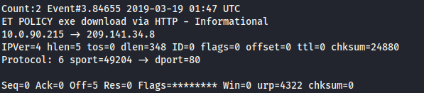
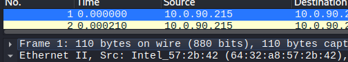
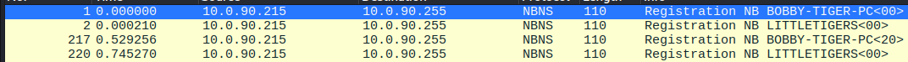
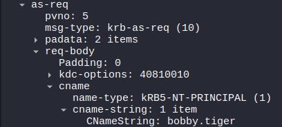
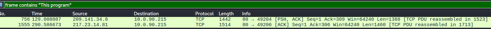
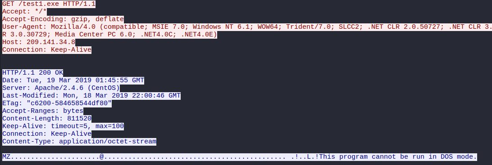
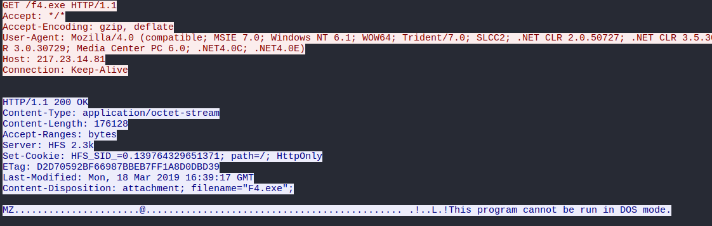
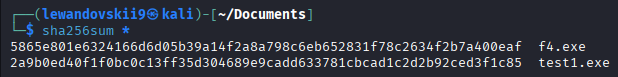
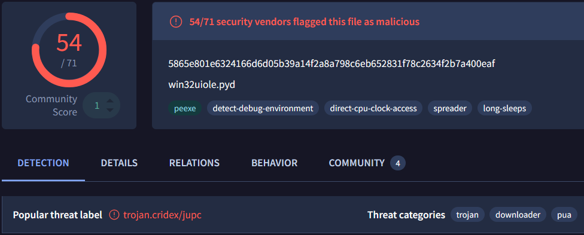
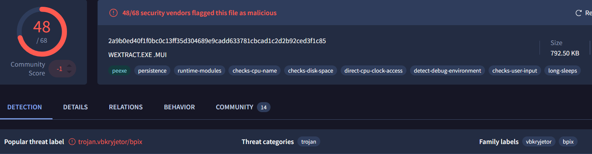

- Link to exercise : https://www.malware-traffic-analysis.net/2019/03/19/index.html
### Executive summary

On 2019-03-19 at 14:44:55 - 14:49:46 UTC, a Windows host(BOBBY-TIGER-PC) at IP(`10.0.90.215`) used by user(bobby.tiger) that belong to `LITTLETIGERS`, was infected with trojan (family `vbkryjetor / Remcos RAT`) and trojan Cridex/Dridex. Data of Host(`10.0.90.215`) can be compromised. Problem was solved, the host (`10.0.90.215` is isolated and prevented further Lateral Movement of infections. All data dump captured for deeper inspection and all passwords of user was reset. 
## ENVIRONMENT

LAN segment data:

- LAN segment range:  10.0.90[.]0/24 (10.0.90[.]0 through 10.0.90[.]255)
- Domain:  littletigers[.]info
- Domain controller:  10.0.90[.]9 - LittleTigers-DC
- LAN segment gateway:  10.0.90[.]1
- LAN segment broadcast address:  10.0.90[.]255

## Task

Review the pcap and alerts, then write an incident report for this infected Windows host.  The zip archive of malware and artifacts is a bonus, provided to help you better understand this infection, if needed. 

## Infected Host

#### Victim Host details : 
- **IP - address** : 10.0.90.215.
- **MAC - address** : 64:32:a8:57:2b:42 (Intel).
- **Hostname** : BOBBY-TIGER-PC.
- **User account**  : bobby.tiger.

### Investigation : 

- By investigation of IDs alerts, i can identify infected host is 10.0.90.215 , it is confirms by `Event#3.84655 2019-03-19 01:47 UTC` on our 1st evidence , this alert show us suspicious actions happening on from our victim (10.0.90.215) to malicious connection on (209.141.34[.]8), exe download via HTTP connection.

Evidence(#1):

- By inspection any packet that related to infected host (10.0.90.215), and further investigation MAC address is `64:32:a8:57:2b:42 (Intel)` :

Evidence(#2)

- Hostname of our victim is BOBBY-TIGER-PC that belongs to group LITTLETIGERS. By applying filter `ap.addr eq '10.0.90.215' and nbns` : 

Evidence(#3)

- User account of infected host is bobby.tiger. Filter `kerberos.CNameString and !(kerberos.CNameString contains "$")`  , fast define user name of infected host :

Evidence(#4)

- To define which infection host (10.0.90.215) was infected, and find all malicious files, i started filter on `frame contains "This program"` , and find 2 malicious files with `MZ` tag :
Evidence(#5)

file 1 `test1[.]exe`:

Evidence(#6)

file 2 `f4[.]exe` : 

Evidence(#7)

By downloading them and investigating i find their hashes:

Evidence(#8)

f4[.]exe hash:
5865e801e6324166d6d05b39a14f2a8a798c6eb652831f78c2634f2b7a400eaf

test1[.]exe hash:
2a9b0ed40f1f0bc0c13ff35d304689e9cadd633781cbcad1c2d2b92ced3f1c85 

And by scanning them in VirusTotal : 
- f4[.]exe:
Evidence(#9)  
  
File f4[.]exe is malicious and 54/71 security vendors flagged this file as malicious. And also we can identify this file as trojan Cridex which is old name for trojan Dridex, also that infection can do Lateral Movement and long - sleep to hide from detection.

- test1[.]exe:
Evidence(#10)
  
File test1[.]exe is also malicious that confrimed by 48/68 security vendors. This trojan is from (family `vbkryjetor`) also this infection hides from detection and evasion as cpu process, also this infection stays after reboot.

## Timeline

| Time UTC | Event                                                                     | Source          | Destination     | Frame                      |
| -------- | ------------------------------------------------------------------------- | --------------- | --------------- | -------------------------- |
| 01:49    | Remcos RAT Checkin 23                                                     | 10.0.90.215     | 103.1.184[.]108 | IDs alert Event#3.84754 |
| 02:03    | TROJAN ABUSE.CH SSL Blacklist Malicious SSL certificate detected (Dridex) | 31.22.4[.]176   | 10.0.90.215     | IDs alert Event#3.84926 |
| 02:08    | TROJAN ABUSE.CH SSL Blacklist Malicious SSL certificate detected (Dridex) | 203.45.1[.]75   | 10.0.90.215     | IDs alert Event#3.84940 |
| 04:54    | TROJAN ABUSE.CH SSL Blacklist Malicious SSL certificate detected (Dridex) | 115.112.43[.]81 | 10.0.90.215     | IDs alert Event#3.84979 |
| 14:44:55 | Host registration (BOBBY-TIGER-PC) registration                           | 10.0.90.215     | 10.0.90.255     | 01                         |
| 14:47:04 | Malicious PE download `f4[.]exe`                                          | 209.141.34[.]8  | 10.0.90.215     | 756                        |
| 14:49:46 | Malicious PE download `test1[.]exe`                                       | 217.23.14[.]81  | 10.0.90.215     | 1555                       |

## IOC

**Network Indicators**

| Type             | Value           | Description                                              |
| ---------------- | --------------- | -------------------------------------------------------- |
| IPv4 (victim)    | 10.0.90.215     | Infected host by Dridex and trojan (family `vbkryjetor`) |
| IPv4 (malicious) | 209.141.34[.]8  | Initiation point with LM                                 |
| IPv4 (malicious) | 217.23.14[.]81  | Infection download                                       |
| IPv4 (malicious) | 103.1.184[.]108 | C2 Infrastructure (Remcos RAT)                           |
| IPv4 (malicious) | 31.22.4[.]176   | Malicious SSL certificate (Dridex)                       |
| IPv4 (malicious) | 203.45.1[.]75   | Malicious SSL certificate (Dridex)                       |
| IPv4 (malicious) | 115.112.43[.]81 | Malicious SSL certificate (Dridex)                       |

**File Indicators**

| Type      | Value                                                            | Description                 |
| --------- | ---------------------------------------------------------------- | --------------------------- |
| File name | f4[.]exe                                                         | Cridex/Dridex trojan        |
| SHA256    | 5865e801e6324166d6d05b39a14f2a8a798c6eb652831f78c2634f2b7a400eaf | sha256 of f4[.]exe PE       |
| File name | test1[.]exe                                                      | trojan (family `vbkryjetor` |
| SHA256    | 2a9b0ed40f1f0bc0c13ff35d304689e9cadd633781cbcad1c2d2b92ced3f1c85 | sha256 of test1[.]exe PE    |

## Verdict

- True Positive. The host 10.0.90.215 is confirmed to be compromised. The infection started with the download of f4[.]exe (Dridex/Cridex) and test1[.]exe (family vbkryjetor). The host shows signs of persistent infection, including C2 communication with Remcos RAT and Dridex infrastructure. The discrepancy between infection time (01:47) and host registration (14:44) suggests the host was active overnight or there is a time-zone offset in the packet capture.
## Response actions

- Isolate the host `10.0.90.215`, to prevent further infection.
- Capture all data that contain host `10.0.90.215`, for deeper inspection.
- Forced password reset for user `bobby.tiger` and any accounts accessed from this host, and notify user `bobby.tiger` and other users that their data was compromised.
- Block all malicious C2 IPs on firewall, to prevent other malicious actions from that IPs.

