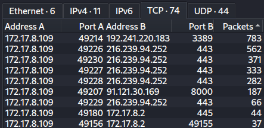
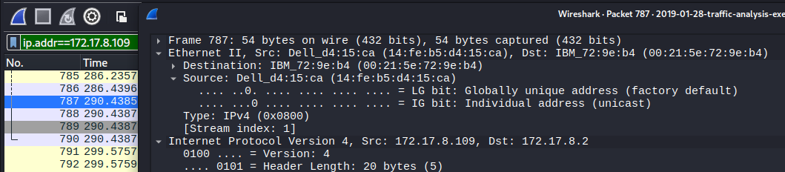
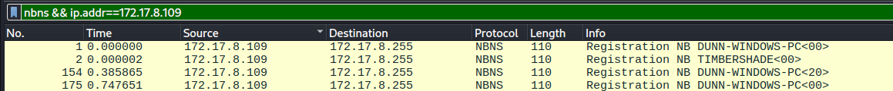
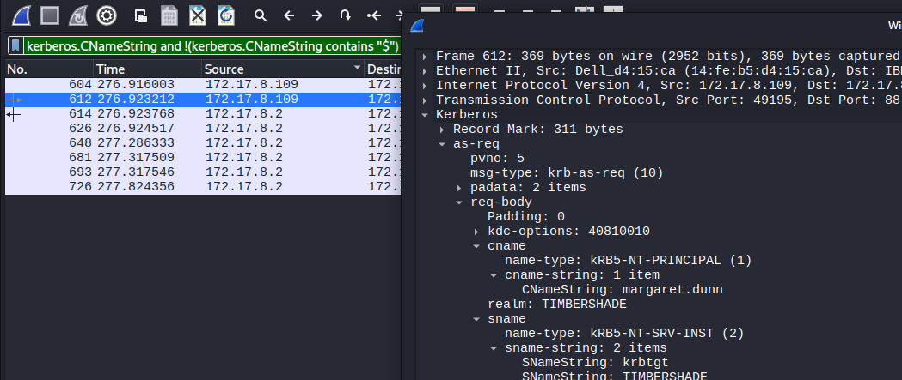
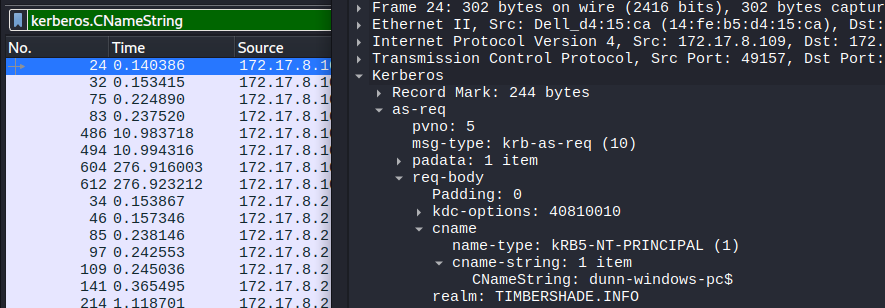
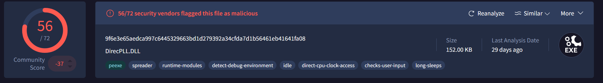

Wireshark analysis task from : https://www.malware-traffic-analysis.net 
Task Scenario : 
LAN segment data:

- LAN segment range:  172.17.8[.]0/24 (172.17.8[.]0 through 172.17.8[.]255)
- Domain:  timbershade[.]info
- Domain controller:  172.17.8[.]2 - Timbershade-DC
- LAN segment gateway:  172.17.8[.]1
- LAN segment broadcast address:  172.17.8[.]255
Task :
Answer the following questions:

1) What is the IP address of the infected Windows host?
2) What is the MAC address of the infected Windows host
3) What is the host name of the infected Windows host
4) What is the Windows user account name for the infected Windows host
5) What is the SHA256 file hash of the Windows executable file sent to the infected Windows host?
6) Based on the IDS alerts, what type of infection is this?

Answer : 

1) IP address of the infected Windows host : 172.17.8.109. Because initiates outbound connections to external IPs on non-standard ports (8000, 3389) , anomalous behavior for a workstation.
   We can see it by statistics of conversation : 
   
   We can see that our LAN IP address is exchanging traffic with several external ip addresses.

2) MAC address of infected Windows host : 172.17.8.109 is 14:fe:b5:d4:15:ca(Dell)
   
   We can see MAC address of our infected machine by applying filter(Filter applied: ip.addr == 172.17.8.109) that shows any communication between our infected IP address machine. And exploring any packet we can see at ethernet 2 section MAC address. 

3) host name of the infected Windows host : DUNN-WINDOWS-PC
   
We can see host name by applying filter nbns that shows workstation naming in LAN. And further applying our victims IP address.

4) Windows user account name for the infected Windows host is margaret.dunn.
   
   We can see it by applying kerberos filters, i want to explain why i added additional filter to kerberos doesnt show user with $ , because i saw before many as-requests that show pc name, not user that i want to find. Here is sample below:
   

5) SHA256: 9f6e3e65aedca997c6445329663bd1d279392a34cfda7d1b56461eb41641fa08, 
   File name: DirecPLL.DLL 56/72 vendors flagged as malicious on VirusTotal : 
   

6) Type of infection: Dridex Trojan 
   Evidence:
   - IDS Alert: ET TROJAN ABUSE.CH SSL Blacklist Malicious SSL certificate detected (Dridex)
   - C2 servers: 192.241.220.183:3389 and 216.239.94.252:443
   - Downloaded payload: DirecPLL.DLL (SHA256: 9f6e3e65aedca997c6445329663bd1d279392a34cfda7d1b56461eb41641fa08)
   - 56/72 VirusTotal vendors flagged as malicious

7) IOCs

| Type           | Value                                                            |
| :------------- | :--------------------------------------------------------------- |
| IP (victim)    | 172.17.8.109                                                     |
| IP (C2 Dridex) | 192.241.220[.]183                                                |
| IP (C2 Dridex) | 216.239.94[.]252                                                 |
| IP (malware)   | 91.121.30[.]169                                                  |
| URL            | http://91.121.30[.]169:8000/91msE95B/actiV.bin                   |
| SHA256         | 9f6e3e65aedca997c6445329663bd1d279392a34cfda7d1b56461eb41641fa08 |
| File name      | DirecPLL.DLL                                                     |
| File type      | Windows PE DLL — Dridex loader                                   |
| Malware family | Dridex Trojan                                                    |

8) Timeline

| Time (UTC) | Event                                         | Direction                           |
| :--------- | :-------------------------------------------- | :---------------------------------- |
| 21:44      | NBNS Registration — DUNN-WINDOWS-PC           | 172.17.8.109 → 172.17.8.255         |
| 21:48      | Kerberos AS-REQ — margaret.dunn authenticates | 172.17.8.109 → 172.17.8.2           |
| 21:49      | TCP SYN — connection to malware server        | 172.17.8.109 → 91.121.30.169:8000   |
| 21:49      | HTTP GET /91msE95B/actiV.bin                  | 172.17.8.109 → 91.121.30.169:8000   |
| 21:49      | DirecPLL.DLL received — 152KB PE (MZ)         | 91.121.30.169 → 172.17.8.109        |
| 21:49      | IDS: PE EXE download + Shellcode detected     | 91.121.30.169 → 172.17.8.109        |
| 21:52      | Dridex C2 beacon — TLS handshake              | 172.17.8.109 → 192.241.220.183:3389 |
| 21:52      | IDS: Dridex SSL certificate detected          | 192.241.220.183 → 172.17.8.109      |
| 21:55      | Dridex C2 beacon — second server              | 172.17.8.109 → 216.239.94.252:443   |
| 21:56      | IDS: second Dridex C2 confirmed               | 216.239.94.252 → 172.17.8.109       |
Result : 

Verdict: True Positive Dridex Trojan.Host 172.17.8.109 (margaret.dunn / DUNN-WINDOWS-PC) 
downloaded malicious PE file DirecPLL.DLL via HTTP from 91.121.30.169:8000 at 21:49 UTC. 
Following execution, the host established C2 communication with Dridex infrastructure at 192.241.220.183:3389 and 216.239.94.252:443.
Confirmed by IDS alerts and VirusTotal (56/72 vendors).

## Response Actions (SOC L1)

1. Isolate host 172.17.8.109 from the network immediately
   to prevent further C2 communication and lateral movement.
2. Preserve forensic evidence — do not wipe the machine
   before L2 investigation.
3. Block malicious IPs on firewall:
   91.121.30[.]169, 192.241.220[.]183, 216.239.94[.]252
4. Escalate to SOC L2 with this report and all IOCs.
5. Notify user margaret.dunn that her account
   may be compromised — password reset decision is L2
