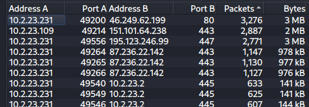
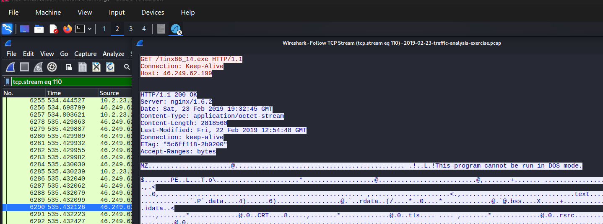
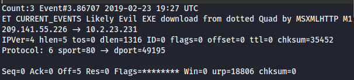

# Trickbot-IcedID-infection

Link to the exercise:
- https://www.malware-traffic-analysis.net/2019/02/23/index.html

## ENVIRONMENT

LAN segment data:

- LAN segment range:  10.2.23[.]0/24 (10.2.23[.]0 through 10.2.23[.]255)
- Domain:  stormtheory[.]info
- Domain controller:  10.2.23[.]2 - Stormtheory-DC
- LAN segment gateway:  10.2.23[.]1
- LAN segment broadcast address:  10.2.23[.]255
## TASK

Answer the following questions:

- What is the IP address of the infected Windows host?
- What is the MAC address of the infected Windows host?
- What is the host name of the infected Windows host?
- What is the Windows user account name for the infected Windows host?
- What are the six URLs that returned Windows executable files to the infected Windows host?
- What are the SHA256 hashes of the six Windows executable files sent to the infected Windows host?
- Based on the IDS alerts, what type of infection (or infections) is this?
## Answers :

### 1) 
**Infected PC, ip address is :** 10.2.23.231, by analyzing statistics of conversation, with further inspecting we can see its infected : 

in destination (10.2.23.231 →  46.249.62[.]199, port 80) by applying (**ip.addr == 10.2.23.231 && ip.addr == 46.249.62[.]199**) and following any packet tcp stream we can see suspicious actions with MZ tag , its (EXE or DLL program because always first bytes of this files shows as MZ) malicious actions confirms that its infected.

and also with inspectig IDs alerts it confirms that IP **10.2.23.231** is infected, there is malicious program downloading that relates with our LAN pc  : 

### 2) 
in any traffic exchange that relates with our infected pc , by further inspection of any package we can find that our infected PC MAC address is  **00:11:0a:9f:c0:2d(HewlettPacka_9f:c0:2d)** : 
![[Pasted image 20260325234405.png]]
### 3) 
by appling (nbns and ip.addr == 10.2.23.231) , by investigation of first package we now see host name of victim PC.
Host name of the infected Windows : **FERGUSON-WIN-PC**
![[Pasted image 20260401153738.png]]
### 4)
by applying filter `kerberos.CNameString and !(kerberos.CNameString contains "$")`, after digging into frame details we find out user account name which is : **ruby.ferguson**  ,also i added `!(kerberos.CNameString contains "$")` filter to display only user accounts, because computer accounts always end with `"$"`.
![[Pasted image 20260401154504.png]]
### 5)
We can download them from Export Objects → HTTP but there is a problem a lot of unnecessary stuff : 
![[Pasted image 20260401162455.png]]

even by looking for with filter we cant find only 3 files : 
![[Pasted image 20260401162522.png]]

Lets move in other way with filters of GET requests, by applying `http.request.method == "GET" && ip.src == 10.2.23.231` we see several requests to download some stuff :

![[Pasted image 20260401162822.png]]

They are all look suspicious (except msdownload it is essential process of windows system) , and by investigating them, we find malicious executable tag `MZ` in packages(3119 `troll1.jpg`, 6249`Tinx86_14.exe`, 6262`Sw9JKmXqaSj.exe`, 10966 `win.png`, 11986 `tin.png`, 20146 `sin.png` )
example : 
![[Pasted image 20260401161845.png]]

With moving back to step downloading files in Export Objects → HTTP , download files by names 
and confirm that this files is executable programs : 
![[Pasted image 20260403003303.png]]
After investigation we can confirm and see that they are executable.

Six URLs delivering executable files were identified via HTTP GET requests:
Their URLs : 
1 - http://85.143.218[.]7/sin.png
2 - http://46.249.62[.]199/Sw9JKmXqaSj.exe
3 - http://85.143.218[.]7/tin.png
4 - http://46.249.62[.]199/Tinx86_14.exe
5 - http://209.141.55[.]226/troll1.jpg
6 - http://85.143.218[.]7/win.png

### 6)
Six hashes : 
![[Pasted image 20260403005438.png]]
3abae6dd2ddae23b2de2ccbcc160a4a5773bef8934d0e6896d50197c3d3c417f  sin.png
d43159c8bf2e1bd866abdbb1687911e2282b1f98a7c063f85ffd53a7f51efed4  Sw9JKmXqaSj.exe
4c957072ab097d3474039f432466cd251d1dc7d91559b76d4e5ead4a8bd499d5  tin.png
f1b789be1126b557240dd0dfe98fc5f3ad6341bb1a5d8be0a954f65b486ad32a  Tinx86_14.exe
8cf2cddda8522975a22da3da429339be471234eacc0e11c099d6dcb732cf3cbb  troll1.jpg
38c6c5b8d6fa71d9856758a5c0c2ac9d0a0a1450f75bb1004dd988e23d73a312  win.png

by checking them on VirusTotal to malicousness, we can confirm that they are infections:

**1 -**  `sin.png` : 
![[Pasted image 20260403005745.png]]

Our first file is trojan, trickbot. 62/72 of Vendors confirm that it is infection

**2 -** `Sw9JKmXqaSj` : 
![[Pasted image 20260403010111.png]]

Second file is also trojan, jaik. 59/72 of Vendors confirm that it is infection.

**3 -** `tin.png`
![[Pasted image 20260403010306.png]]

Third file is also trojan, barys. 61/70  of Vendors confirm that it is infection.

**4 -** `Tinx86_14.exe`
![[Pasted image 20260403010457.png]]

 Fourth file is also trojan, dump . 57/72 of Vendors confirm that it is infection.

**5 -** `troll1.jpg(melodium.exe)`
![[Pasted image 20260403010642.png]]
 Fifth file is also trojan, ponystealer.  62/71 of Vendors confirm that it is infection.
**6 -** `win.png`
![[Pasted image 20260403010900.png]]
Sixth file is also trojan, trickbot .  63/72 of Vendors confirm that it is infection.

### 7)
Based on investigation of IDs alerts, we can confirm 2 infections on 1st evidence it displays Trickbot infection , and on 2nd evidence it displays IcedID infection.

Evidences : 
1) ![[Pasted image 20260403012032.png]]
2) ![[Pasted image 20260403012142.png]]

## IOCs

| Type           | Value                                                            |
| -------------- | ---------------------------------------------------------------- |
| IP (victim)    | 10.2.23.231 (Windows, HewlettPacka_9f:c0:2d)                     |
| IP (malicious) | 46.249.62[.]199                                                  |
| IP (malicious) | 209.141.55[.]226                                                 |
| IP (malicious) | 85.143.218[.]7                                                   |
| URL, 1         | http://85.143.218[.]7/sin.png                                    |
| URL, 2         | http://46.249.62[.]199/Sw9JKmXqaSj.exe                           |
| URL, 3         | http://85.143.218[.]7/tin.png                                    |
| URL, 4         | http://46.249.62[.]199/Tinx86_14.exe                             |
| URL, 5         | http://209.141.55[.]226/troll1.jpg                               |
| URL, 6         | http://85.143.218[.]7/win.png                                    |
| File name, 1   | sin.png                                                          |
| File name, 2   | Sw9JKmXqaSj.exe                                                  |
| File name, 3   | tin.png                                                          |
| File name, 4   | Tinx86_14.exe                                                    |
| File name, 5   | troll1.jpg                                                       |
| File name, 6   | win.png                                                          |
| File type, 1   | Windows PE EXE                                                   |
| File type, 2   | Windows PE EXE                                                   |
| File type, 3   | Windows PE EXE                                                   |
| File type, 4   | Windows PE EXE                                                   |
| File type, 5   | Windows PE EXE                                                   |
| File type, 6   | Windows PE EXE                                                   |
| SHA256, 1      | 3abae6dd2ddae23b2de2ccbcc160a4a5773bef8934d0e6896d50197c3d3c417f |
| SHA256, 2      | d43159c8bf2e1bd866abdbb1687911e2282b1f98a7c063f85ffd53a7f51efed4 |
| SHA256, 3      | 4c957072ab097d3474039f432466cd251d1dc7d91559b76d4e5ead4a8bd499d5 |
| SHA256, 4      | f1b789be1126b557240dd0dfe98fc5f3ad6341bb1a5d8be0a954f65b486ad32a |
| SHA256, 5      | 8cf2cddda8522975a22da3da429339be471234eacc0e11c099d6dcb732cf3cbb |
| SHA256, 6      | 38c6c5b8d6fa71d9856758a5c0c2ac9d0a0a1450f75bb1004dd988e23d73a312 |
| Malware family | Trickbot                                                         |
| Malware family | IcedID                                                           |

## Timeline

| Time(UTC) | Event                                       | Direction                       |
| --------- | ------------------------------------------- | ------------------------------- |
| 19:27     | EXE delivered as fake JPG (troll1.jpg)      | 209.141.55[.]226 → 10.2.23.231  |
| 19:27     | IDS Alert: JS/WSF Downloader detected       | 209.141.55[.]226 → 10.2.23.231  |
| 19:33     | EXE delivered (Tinx86_14.exe)               | 46.249.62[.]199 → 10.2.23.231   |
| 19:33     | EXE delivered (Sw9JKmXqaSj.exe)             | 46.249.62[.]199 → 10.2.23.231   |
| 19:34     | IDS Alert: IcedID WebSocket Request         | 10.2.23.231 → 87.236.22[.]142   |
| 19:39     | EXE delivered as fake PNG (win/tin/sin.png) | 85.143.218[.]7 → 10.2.23.231    |
| 19:39     | IDS Alert: Trickbot C2 activity             | 10.2.23.231 → 85.143.218[.]7    |
| 19:50     | IDS Alert: Trickbot Data Exfiltration       | 10.2.23.231 → 190.146.112[.]216 |

## Verdict

True positive incident, related to Trickbot and IcedID malware family. 1 of PC `10.2.23.231` was infected , and from our LAN segment victim PC, started several file exchange with outer connection. IDS alerts confirmed suspicious activity `ET CURRENT_EVENTS Likely Evil EXE download` from direct  `209.141.55[.]226` to `10.2.23.231`. After investigation files packages, i found that they are all with `MZ` tag and confirmed as malicious executables, and after investigation their sha256, in VirusTotal most of the vendors (80%>)  confirmed that files is trojan from Trickbot and IcedID malware family.

## Response actions

1) Isolate host `10.2.23.231` , to prevent further infection.
2) Block malicious IPs on firewall: 46.249.62[.]199 , 209.141.55[.]226, 85.143.218[.]7.
3) Preserve forensic evidence, do not wipe machine before SOC L2 investigation.
4) Escalate to SOC L2 with all evidences and IOCs.
5) Notify user ruby.ferguson that her account compromised.
